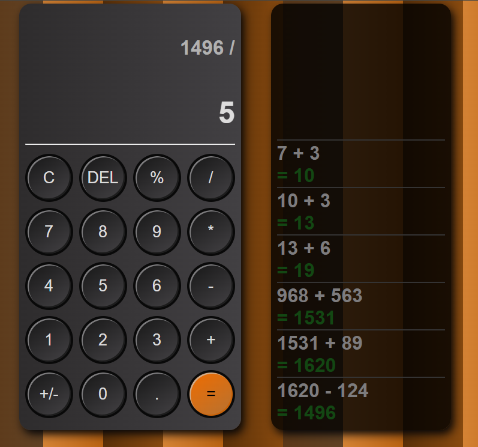
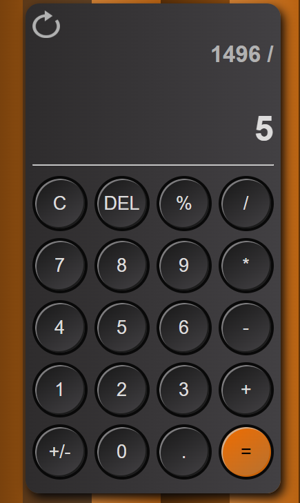
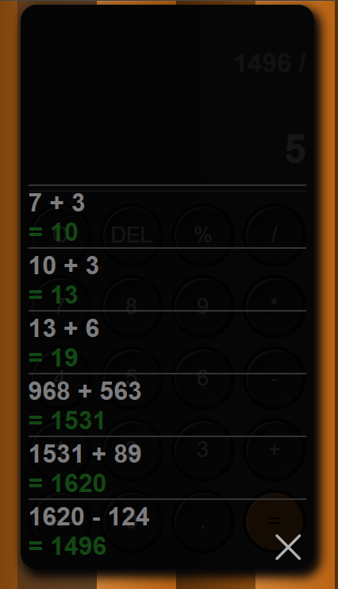

# ✨ Web Calculator - HTML, CSS & JavaScript

This is a simple **Web Calculator** built using **HTML, CSS, and JavaScript**. The calculator provides essential arithmetic operations and additional features to improve usability.

## 🚀 Features
- ➕ **Addition**
- ➖ **Subtraction**
- ✖️ **Multiplication**
- ➗ **Division**
- % **Percentage Calculation**
- ⌫ **Delete Last Input**
- ♻️ **Clear All Inputs**
- �️ **Negation of Numbers (+/-)**
- � **Decimal Point Support**
- 💎 **Stylish UI with Responsive Design**

## 🔗 Live Demo
You can access the calculator online via the following link:  
**[Web Calculator](https://shemichadnan.github.io/Web-calculator/)**

## 🛠️ Tech Stack
- **HTML** - Structure
- **CSS** - Styling & Responsiveness
- **JavaScript** - Functionality

## 🛠 Installation
1. Clone the repository:
   ```bash
   git clone https://github.com/ShemichAdnan/Web-calculator.git
   cd Web-calculator
   ```
2. Open `index.html` in your browser

## 📸 Screenshots
- **Desktop view**<br>
<br>
- **Mobile view**<br>




## 👤 Author
- **Adnan Šemić** - [GitHub](https://github.com/ShemichAdnan)

